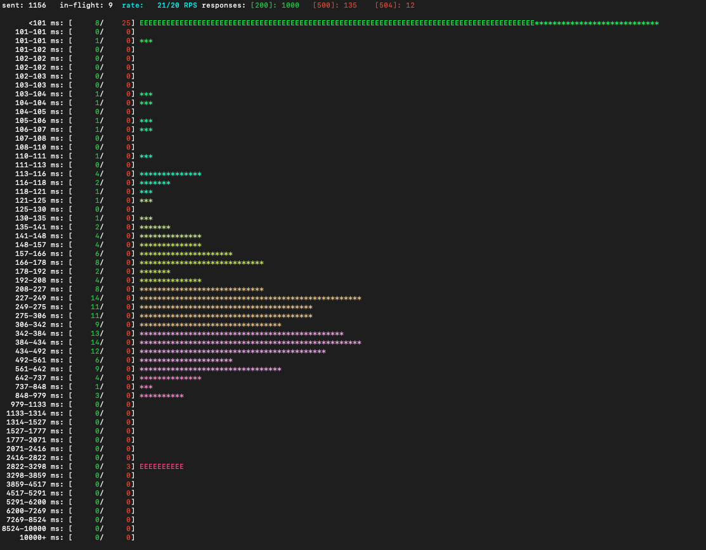
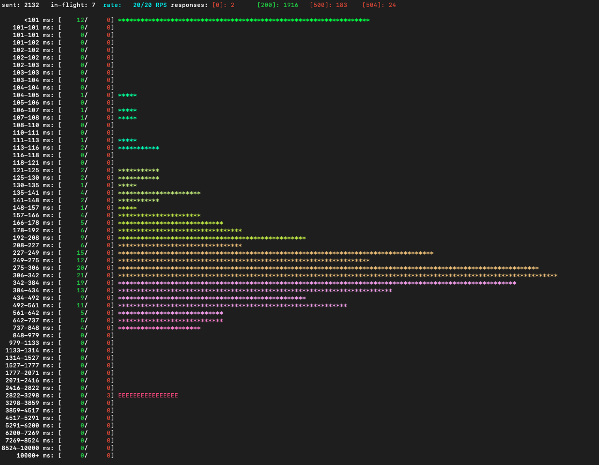

Добавляем репозиторий с чартом амбассадора

```bash
helm repo add datawire https://getambassador.io
```

Устанавливаем амбассадор 

```
➜  ambassador-retry git:(master) ✗ helm install ambassador datawire/ambassador -f ambassador_values.yaml
```

```
NAME                              READY   STATUS    RESTARTS   AGE
pod/ambassador-79f7cf56cd-2bdql   0/1     Running   0          18s
pod/ambassador-79f7cf56cd-z8s55   0/1     Running   0          18s

NAME                       TYPE        CLUSTER-IP      EXTERNAL-IP   PORT(S)
             AGE
service/ambassador         NodePort    10.107.16.182   <none>        80:30866/TCP,443
:30497/TCP   18s
service/ambassador-admin   ClusterIP   10.111.246.32   <none>        8877/TCP
             18s

NAME                         READY   UP-TO-DATE   AVAILABLE   AGE
deployment.apps/ambassador   0/2     2            0           18s

NAME                                    DESIRED   CURRENT   READY   AGE
replicaset.apps/ambassador-79f7cf56cd   2         2         0       18s
```

Собираем и устанавливаем приложение, которое будет эмулировать плохо работающее приложение

```
➜  ambassador-retry git:(master) ✗ cd app
➜  app git:(master) ✗ skaffold run
Generating tags...
 - app -> app:latest
Checking cache...
 - app: Found. Tagging
Tags used in deployment:
 - app -> app:2a21b37d3fdbe11c4a9fb42c54e23a3a8c6882d14797c6fb21cb7ed29335a86d
   local images can't be referenced by digest. They are tagged and referenced by a unique ID instead
Starting deploy...
Helm release app not installed. Installing...
NAME: app
LAST DEPLOYED: Mon May 11 19:06:11 2020
NAMESPACE: auth
STATUS: deployed
REVISION: 1
NOTES:
TO BE DONE
WARN[0002] error adding label to runtime object: patching resource auth/"app-test-connection": pods "app-test-connection" not found
Waiting for deployments to stabilize...
Deployments stabilized in 15.822579ms
You can also run [skaffold run --tail] to get the logs
➜  app git:(master) ✗
```

Приложение будет генерировать 10% 500ок и 1% очень долгих ответов 
```yaml
-- ➜  ambassador-retry git:(master) ✗ cat app/app-chart/values.yaml
replicaCount: 2

fullnameOverride: "app"

image: "app:0.1.0"

service:
  type: NodePort
  port: 9000

rate:
  fail: 0.1
  slow: 0.01
```

```
➜  ambassador-retry git:(master) ✗ kubectl apply -f ambassador/
```

```yaml
apiVersion: getambassador.io/v2
kind: Host
metadata:
  name: hello-world
spec:
  hostname: hello.world
  acmeProvider:
    authority: none
  requestPolicy:
    insecure:
      action: Route
```

```yaml
apiVersion: getambassador.io/v2
kind:  Mapping
metadata:
  name:  app-mapping
spec:
  prefix: /app
  service: app:9000

  # # retries
  # # https://www.envoyproxy.io/docs/envoy/v1.9.0/configuration/http_filters/router_filter#x-envoy-retry-on
  # retry_policy:
  #   retry_on: "5xx"
  #   num_retries: 10
```

Ambassador запущен в роли  API Gateway, но не в роли INgress, поэтому чтобы обратиться к нему, нужно запускать обращаться на порт миникуба, а не по домену. 

```
➜  ambassador-retry git:(master) ✗ kubectl get --namespace auth -o jsonpath="{.spec.ports[0].nodePort}" services ambassador
30866%
➜  ambassador-retry git:(master) ✗ kubectl get nodes --namespace auth -o jsonpath="{.items[0].status.addresses[0].address}"
192.168.64.4%
```

запускаем слаппер из другого терминала, в котором нет docker-env миникуба 

```
➜  ambassador-retry git:(master) ✗ ./slapper http://192.168.64.4:30866/app/probe
```

Пятисоток примено, как в нашем конфиге 10%




Раскомментируем retry policy

```
➜  ambassador-retry git:(master) ✗ vim ambassador/mapping.yaml
➜  ambassador-retry git:(master) ✗ cat ambassador/mapping.yaml
apiVersion: getambassador.io/v2
kind:  Mapping
metadata:
  name:  app-mapping
spec:
  prefix: /app
  service: app:9000

  # # retries
  # # https://www.envoyproxy.io/docs/envoy/v1.9.0/configuration/http_filters/router_filter#x-envoy-retry-on
  retry_policy:
    retry_on: "5xx"
    num_retries: 10
```

```bash
➜  ambassador-retry git:(master) ✗ kubectl apply -f ambassador/mapping.yaml
mapping.getambassador.io/app-mapping configured
➜  ambassador-retry git:(master) ✗
```

Количество 500ок существенно уменьшилось.



