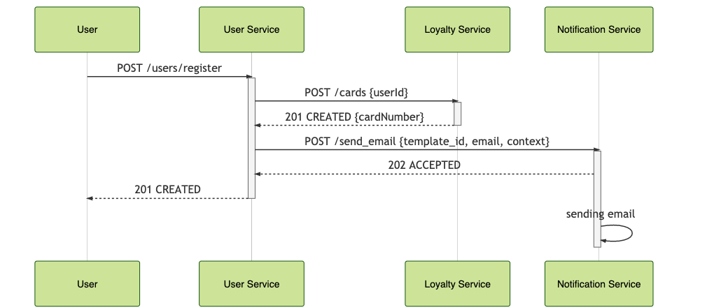
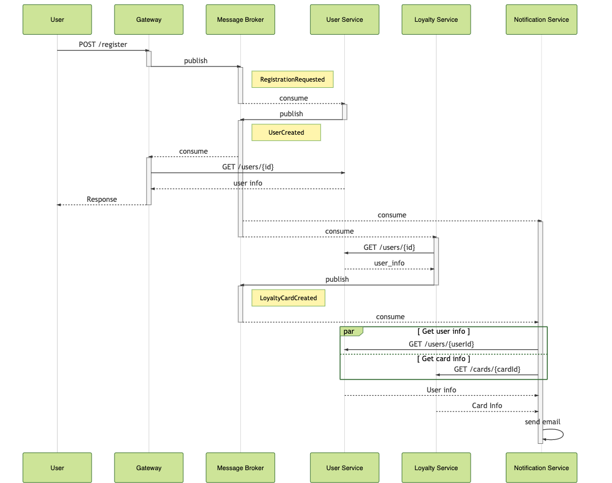
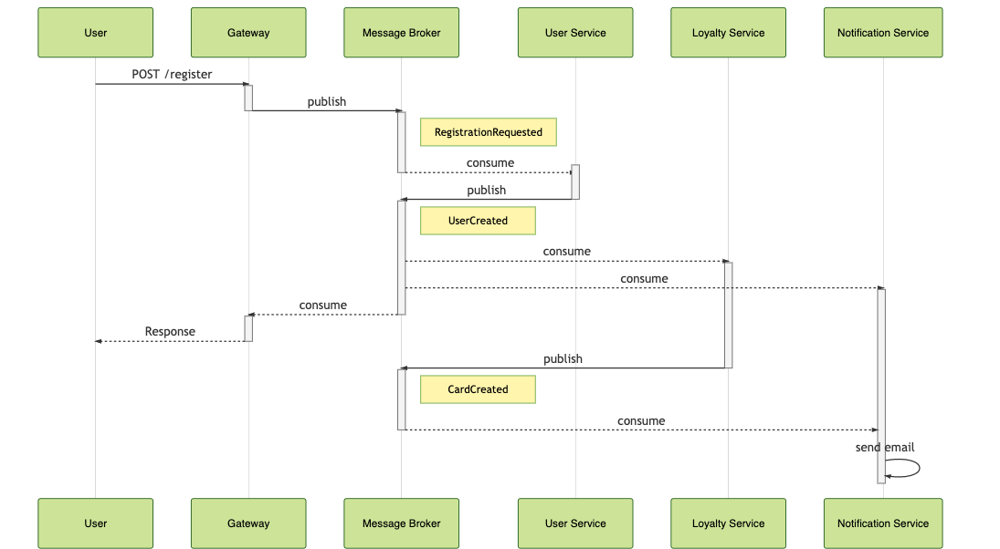

## Сценарий:

- Пользователь заходит на страничку регистрации. 
- Пользователь вводит в форму регистрации идентификационные данные и почту. 
- Пользователь нажимает на кнопку "Регистрация"
- Пользователю показывается информация об успешной регистрации. 
- Регистрируется карта лояльности.
- Через некоторое время пользователю приходит письмо об успешной регистрации вместе с номером карточки лояльности. 

## RESTful

[Описание REST интерфейсов](http://petstore.swagger.io/?url=https%3A%2F%2Fraw.githubusercontent.com%2Fschetinnikov-otus%2Farch-labs%2Fmaster%2Fapi-spec%2Frestful%2Frest-openapi.yaml)

User Service фактически выполняет роль Оркестратора сервисов. Из-за синхронной модели взаимодействия User Service "ждет" дольше, чем надо. Потенциально можно было бы отдать ответ, как только был создан пользователь, а действия связанные с созданием карты и отсылкой почты - асинхронно. 

Но за счет синхронного взаимодействия схема получилась крайне простой и понятной.  

## RPC over Message Bus

[Описание ASYNC интерфейсов](./message-bus/bus-asyncapi.yaml) (для человекочитаемого просмотра лучше воспользоваться  https://playground.asyncapi.io/ )

User Service в случае использования паттерна Message Bus также является оркестратором, только через очередь. И в данном случае User Service отдает ответ клиенту ровно тогда, когда пользователя зарегистрировали. Также для трансляции протоколов (HTTP -> MQ) используется gateway. 

## Event Notifications

[Описание REST интерфейcов](http://petstore.swagger.io/?url=https%3A%2F%2Fraw.githubusercontent.com%2Fschetinnikov-otus%2Farch-labs%2Fmaster%2Fapi-spec%2Fevent-notifications%2Fnotif-openapi.yaml#/)

[Описание ASYNC интерфейсов](./event-notifications/notif-asyncapi.yaml)

Вместо RPC вызовов используем для команд - события-нотификации. В payload событий добавлены только самые существенные данные - userId, cardId и т.д. Всю остальную информацию дргие сервисы вынуждены спрашивать у сервиса по RESTful протоколу. Также для общения с конечными устройствами используется gateway - сервис транслятор протоколов.

В данном случае получается в большей степени хореография и Notification Service сам ждет событий от других сервисов и принимает решение что нужно отправить welcome сообщение. 

Минус такой схемы конечно же большое количество GET запросов и повышенная нагрузка на чтение для других сервисов. 

## Event Collaboration

[Описание ASYNC интерфейсов](./event-collab/collab-asyncapi.yaml)

Для того, чтобы исключить "лишние" чтения будем все необходимые данные передавать в payload сообщения. Это позволит избежать лишних чтений, но заставит хранить в сервисах свою "локальную" копию данных из других сервисов. 

При этом схема взаимодействия становится немного проще. 

Опять-таки проблемой становится поддержание в консистентном состоянии локальной копии данных. Например, при изменение профиля клиента Notification Service должен будет читать события UserUpdated и применять их у себя. Т.е. в случае возникновения новых событий нужно помнить про то, что эти события должны быть применены в других сервисах. 

