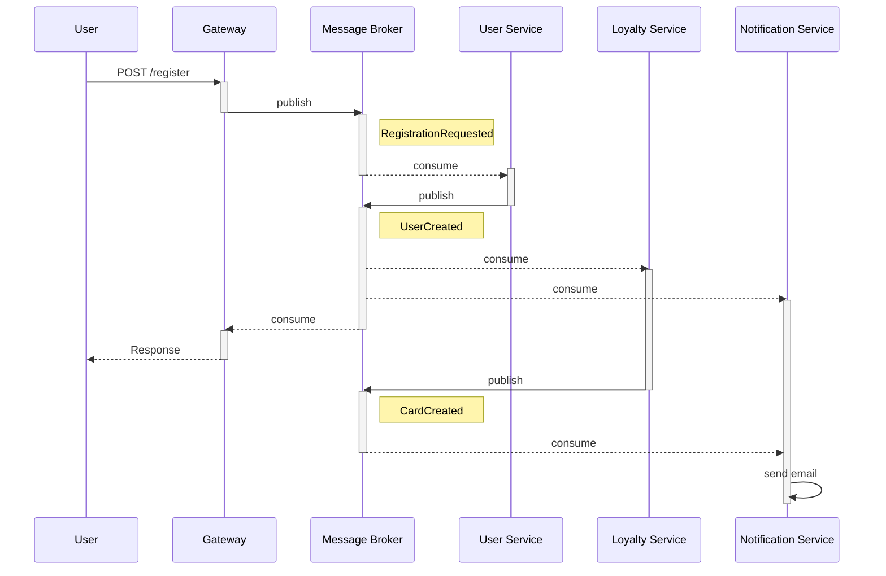

```mermaid
sequenceDiagram
participant User
participant Gateway
participant Message Broker
participant User Service
participant Loyalty Service
participant Notification Service

User ->>+ Gateway: POST /register
Gateway ->>- Message Broker: publish
activate Message Broker
Note right of Message Broker: RegistrationRequested
Message Broker -->>+ User Service: consume
deactivate Message Broker
User Service ->>- Message Broker: publish
activate Message Broker
Note right of Message Broker: UserCreated
Message Broker -->> Loyalty Service: consume
activate Loyalty Service
Message Broker -->> Notification Service: consume
activate Notification Service
Message Broker -->> Gateway: consume
activate Gateway
deactivate Message Broker
Gateway -->> User: Response
deactivate Gateway
Loyalty Service ->> Message Broker: publish
deactivate Loyalty Service
activate Message Broker
Note right of Message Broker: CardCreated
Message Broker -->> Notification Service: consume
deactivate Message Broker
Notification Service ->> Notification Service: send email
deactivate Notification Service
```
