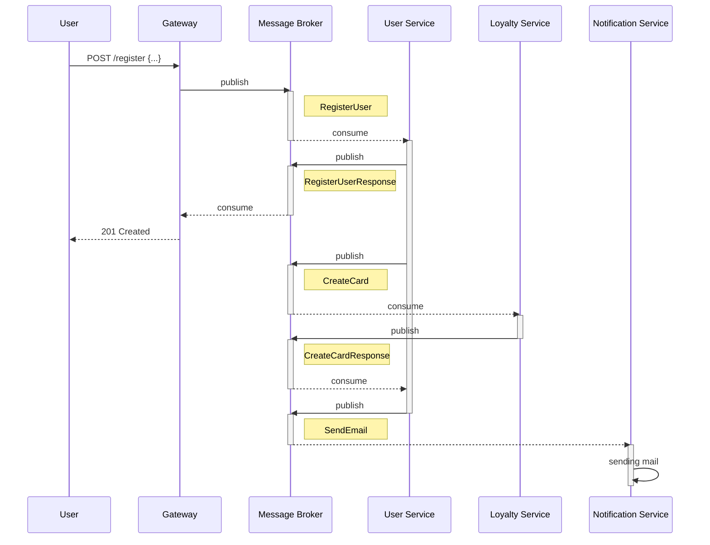

```mermaid
sequenceDiagram
participant User
participant Gateway
participant Message Broker
participant User Service
participant Loyalty Service
participant Notification Service

User->>Gateway: POST /register {...}
Gateway->>Message Broker:  publish
activate Message Broker
Note right of Message Broker: RegisterUser
Message Broker -->> User Service: consume
deactivate Message Broker
activate User Service
User Service->>Message Broker: publish
activate Message Broker
Note right of Message Broker: RegisterUserResponse
Message Broker -->> Gateway: consume
deactivate Message Broker
Gateway -->> User: 201 Created
User Service->>Message Broker: publish
activate Message Broker
Note right of Message Broker: CreateCard
Message Broker-->>Loyalty Service: consume
deactivate Message Broker
activate Loyalty Service
Loyalty Service->>Message Broker: publish
deactivate Loyalty Service
activate Message Broker
Note right of Message Broker: CreateCardResponse
Message Broker-->>User Service: consume
deactivate Message Broker
User Service->>Message Broker: publish
deactivate User Service
activate Message Broker
Note right of Message Broker: SendEmail
Message Broker-->>Notification Service:   
deactivate Message Broker
activate Notification Service
Notification Service ->> Notification Service: sending mail
deactivate Notification Service
```
