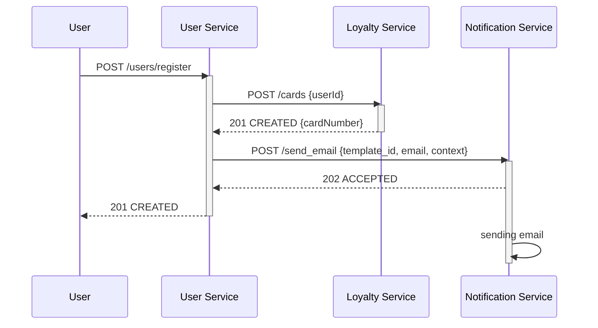

```mermaid
sequenceDiagram

participant User
participant User Service
participant Loyalty Service
participant Notification Service
	
User->>User Service: POST /users/register
activate User Service
%% Note right of User Service: создание карты лояльности
User Service->>Loyalty Service: POST /cards {userId}
activate Loyalty Service
Loyalty Service-->>User Service: 201 CREATED {cardNumber}
deactivate Loyalty Service
User Service->>Notification Service: POST /send_email {template_id, email, context}
activate Notification Service
Notification Service -->> User Service: 202 ACCEPTED
User Service-->>User: 201 CREATED
deactivate User Service
Notification Service ->> Notification Service: sending email
deactivate Notification Service
```
