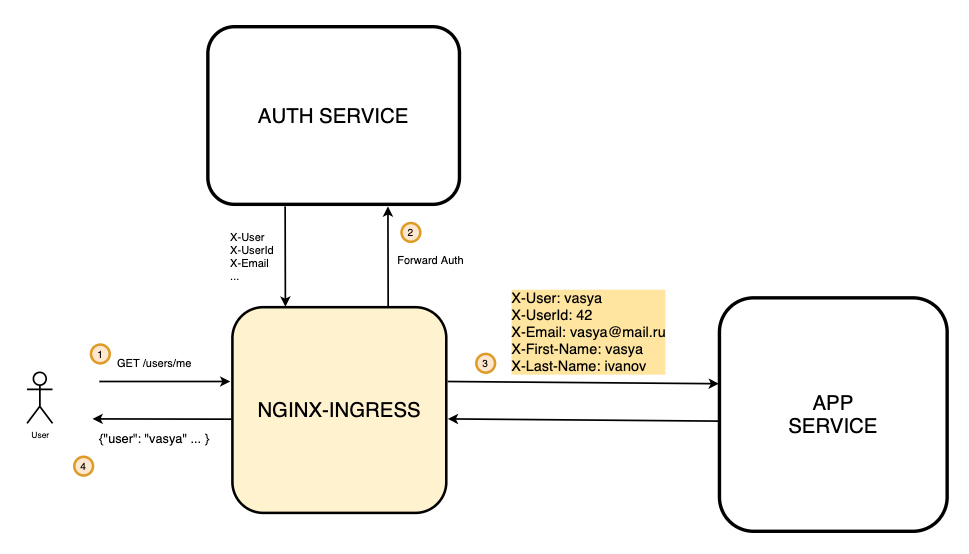

Архитектура решения




В начале убедиться, что nginx ingress запущен

```
➜  nginx-forward-auth git:(master) ✗ minikube addons  enable ingress
🌟  The 'ingress' addon is enabled
```

Собираем и запускаем с помощью skaffold сервис аутентификации

```bash
➜  nginx-forward-auth git:(master) ✗ cd auth
➜  auth git:(master) ✗ skaffold run
Generating tags...
 - auth -> auth:latest
Checking cache...
 - auth: Found Locally
Tags used in deployment:
 - auth -> auth:cde52ae856e0705fdcf80d8e5cf9254b8af5ec9b38eb61613010140d1e942f3a
   local images can't be referenced by digest. They are tagged and referenced by a unique ID instead
Starting deploy...
Helm release auth not installed. Installing...
```

И приложение, в котором мы будем проверять аутентификацию 
```bash
➜  nginx-forward-auth git:(master) ✗ cd app
➜  app git:(master) ✗ skaffold run
Generating tags...

 - app -> app:latest
Checking cache...
 - app: Found. Tagging
Tags used in deployment:
 - app -> app:1a4d7ceecee37bbce9f995c11dae74ec996c3c92bf7e673db03232eb32051427
   local images can't be referenced by digest. They are tagged and referenced by a unique ID instead
Starting deploy...
Helm release app not installed. Installing...
NAME: app
```

Применяем манифст для сервиса аутентификации
```bash
➜ nginx-forward-auth git:(master) ✗ kubectl apply -f auth-ingress.yaml

ingress.networking.k8s.io/auth-proxy created
```

В файле app-ingress.yaml выставлены настройки аутентификации через аннотации.

Auth-url - это урл, который осуществляет проверку на аутентификацию 
Стоит обратить внимание, что урл имеет полное доменное имя внутри кластера (вместе с указанием неймспейса - auth), потому что nginx запущен в другом неймспейсе. 

Также есть указание какие заголовки будут прокидываться в сервис app из сервиса auth.

```yaml
-- cat app-ingress.yaml
apiVersion: networking.k8s.io/v1beta1
kind: Ingress
metadata:
  name: app
  annotations:
    nginx.ingress.kubernetes.io/auth-url: "http://auth.auth.svc.cluster.local:9000/auth"
    nginx.ingress.kubernetes.io/auth-signin: "http://$host/signin"
    nginx.ingress.kubernetes.io/auth-response-headers: "X-User,X-Email,X-UserId,X-First-Name,X-Last-Name"
spec:
  rules:
  - host: arch.homework
    http:
      paths:
      - backend:
          serviceName: app
          servicePort: 9000
        path: /users/me
```

Применяем ингресс для приложения
```
➜  nginx-forward-auth git:(master) ✗ kubectl apply -f app-ingress.yaml
ingress.networking.k8s.io/app created
```

После настройки
Запускаем тесты с помощью newman и проверяем, что все корректно запустилось. 

```
➜  nginx-forward-auth git:(master) ✗ newman run nginx\ forward\ auth.postman_collection.json
newman

nginx forward auth

→ регистрация
  POST http://arch.homework/register [200 OK, 174B, 46ms]
  ✓  [INFO] Request: {
	"login": "Malachi34",
	"password": "Vx6kc_O_2DjY_ba",
	"email": "Gayle_Mraz50@hotmail.com",
	"first_name": "Gennaro",
	"last_name": "Reinger"
}

  ✓  [INFO] Response: {
  "id": 3
}


→ логин
  POST http://arch.homework/login [200 OK, 264B, 10ms]
  ✓  [INFO] Request: {"login": "Malachi34", "password": "Vx6kc_O_2DjY_ba"}
  ✓  [INFO] Response: {
  "status": "ok"
}


→ проверить данные о пользователе
  GET http://arch.homework/auth [200 OK, 407B, 5ms]
  ✓  [INFO] Request: [object Object]
  ✓  [INFO] Response: {
  "email": "Gayle_Mraz50@hotmail.com",
  "first_name": "Gennaro",
  "id": 3,
  "last_name": "Reinger",
  "login": "Malachi34"
}

  ✓  test token data

→ получить данные о пользователе
  GET http://arch.homework/users/me [200 OK, 297B, 7ms]
  ✓  [INFO] Request: [object Object]
  ✓  [INFO] Response: {
  "email": "Gayle_Mraz50@hotmail.com",
  "first_name": "Gennaro",
  "id": "3",
  "last_name": "Reinger",
  "login": "Malachi34"
}


→ логаут
  GET http://arch.homework/logout [200 OK, 253B, 5ms]
  ✓  [INFO] Request: [object Object]
  ✓  [INFO] Response: {
  "status": "ok"
}


→ получить данные после разлогина
  GET http://arch.homework/users/me [200 OK, 225B, 7ms]
  ✓  [INFO] Request: [object Object]
  ✓  [INFO] Response: {
  "message": "Please go to login and provide Login/Password"
}


┌─────────────────────────┬──────────────────┬──────────────────┐
│                         │         executed │           failed │
├─────────────────────────┼──────────────────┼──────────────────┤
│              iterations │                1 │                0 │
├─────────────────────────┼──────────────────┼──────────────────┤
│                requests │                6 │                0 │
├─────────────────────────┼──────────────────┼──────────────────┤
│            test-scripts │                9 │                0 │
├─────────────────────────┼──────────────────┼──────────────────┤
│      prerequest-scripts │                7 │                0 │
├─────────────────────────┼──────────────────┼──────────────────┤
│              assertions │               13 │                0 │
├─────────────────────────┴──────────────────┴──────────────────┤
│ total run duration: 236ms                                     │
├───────────────────────────────────────────────────────────────┤
│ total data received: 391B (approx)                            │
├───────────────────────────────────────────────────────────────┤
│ average response time: 13ms [min: 5ms, max: 46ms, s.d.: 14ms] │
└───────────────────────────────────────────────────────────────┘
➜  nginx-forward-auth git:(master) ✗
```
